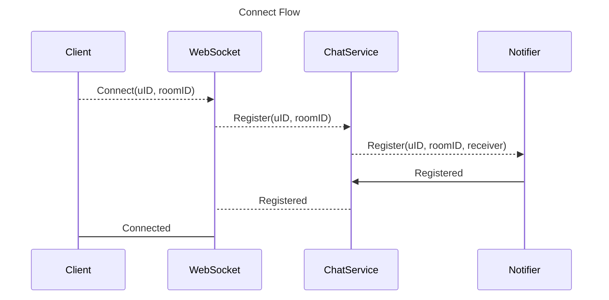
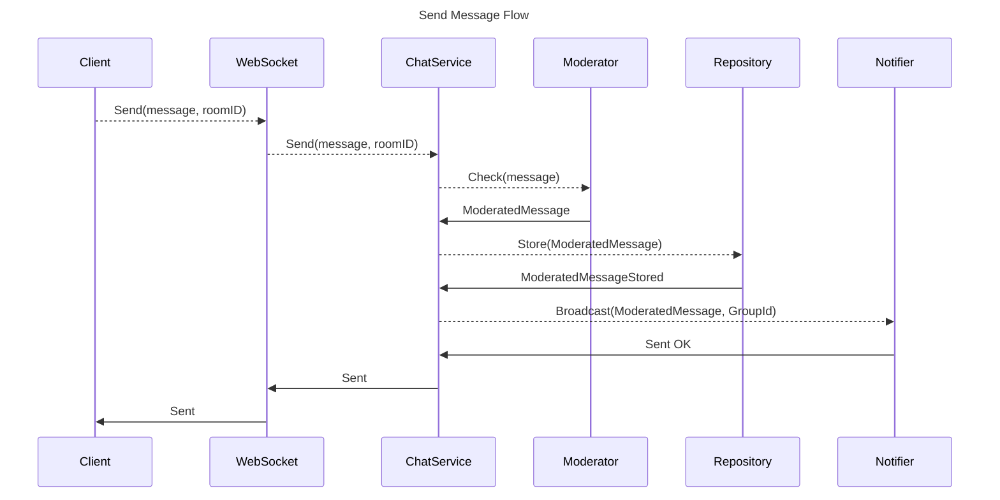

# Simple Chat
Simple Chat service using Hexagonal Architecture with Go

---

## How to run 

- Install [Golang](https://go.dev/)
- Install [tflocal](https://github.com/localstack/terraform-local)
- Install [Docker](https://www.docker.com/products/docker-desktop/) or [Podman](https://podman.io/)
- Install Docker [Compose](https://github.com/docker/compose)
- Install [AWS CLI](https://aws.amazon.com/cli/)
- Install [GolangCI Linter](https://golangci-lint.run/usage/install/)
- Install [gomock](https://thedevelopercafe.com/articles/mocking-interfaces-in-go-with-gomock-670b1a640b00) 

## Use Makefile targets

Short version if you have all the tools installed and configured (never happens :) )
(it will start a local web page http://localhost:8081 that you can connect to play with chat)

`make setup`

Create containers to run the service with docker compose

`make infra-up`

Run local infra setup - executes terraform code against [LocalStack](https://github.com/localstack/localstack)

`make infra-local` #

Executes tests and creates coverage report against local infra

`make cover`

--- 
# Architecture 

- Handler: http with WebSocket
- Repository: DynamoDB
- Notifier: RabbitMQ
- Moderator: Ignore (just passthrough the message, no moderation done)

--- 

# TODO
 
- [ ] Implement a Presence component that embeds the notification system
- [ ] Improve tests that cover errors
- [x] Integrate a mock framework (gomock)
- [ ] Separated UnitTest from Integration Tests (with local infra)
- [x] Integrate Golang Linters
- [x] Implement WebSocket Handler 
- [ ] Add CICD with Github Actions
- [ ] Add Configuration (Consul, Vault)
- [ ] Add logging 
- [ ] Add metricts 
- [ ] Add rate limiting
- [ ] Add Load Tests Local
- [ ] Add Load Tests Cloud 
- [ ] Add Grafana, Prometheus to Docker Compose
- [ ] Add deployment on ECS 
- [ ] Add deployment on K8S
- [ ] Add deployment on Nomad
- [ ] Explore coverage report in Github [https://github.com/johejo/go-cover-view]

# FIX

- [ ] - Remove dependency of AWS CLI by running in a container
